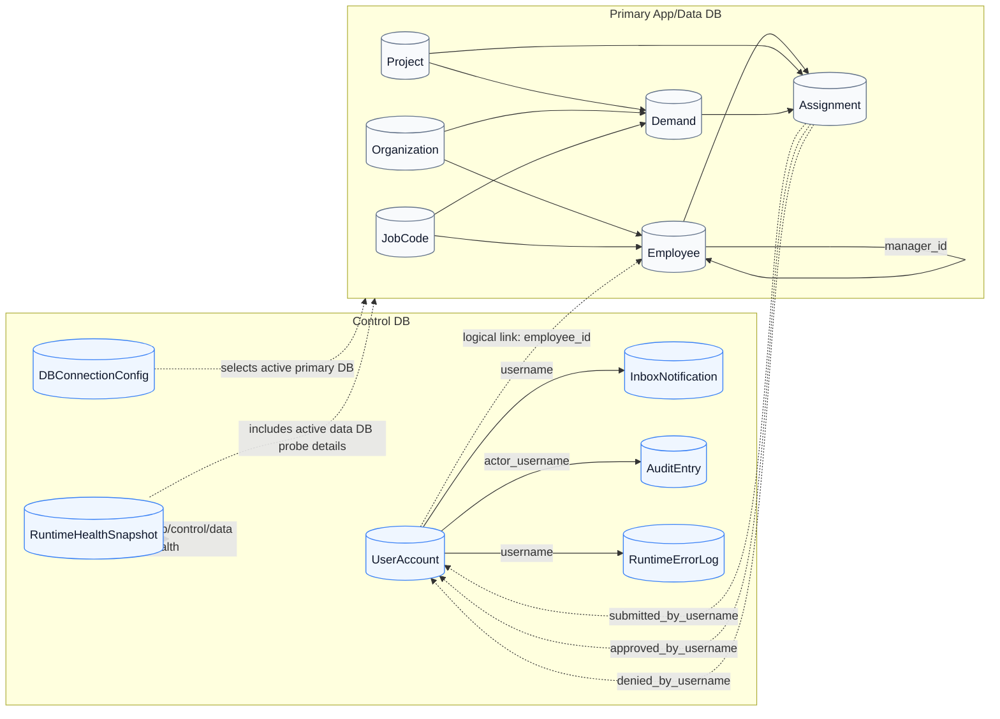

```mermaid
flowchart LR
    subgraph CONTROL[Control DB]
        UA[(UserAccount)]
        DBC[(DBConnectionConfig)]
        INBOX[(InboxNotification)]
        AUDIT[(AuditEntry)]
        RERR[(RuntimeErrorLog)]
        RHS[(RuntimeHealthSnapshot)]
    end

    subgraph DATA[Primary App/Data DB]
        ORG[(Organization)]
        JC[(JobCode)]
        EMP[(Employee)]
        PROJ[(Project)]
        DEM[(Demand)]
        ASN[(Assignment)]
    end

    UA -->|username| INBOX
    UA -->|actor_username| AUDIT
    UA -->|username| RERR

    ORG --> EMP
    JC --> EMP
    EMP -->|manager_id| EMP

    PROJ --> DEM
    ORG --> DEM
    JC --> DEM

    EMP --> ASN
    PROJ --> ASN
    DEM --> ASN

    UA -. logical link: employee_id .-> EMP
    ASN -. submitted_by_username .-> UA
    ASN -. approved_by_username .-> UA
    ASN -. denied_by_username .-> UA

    DBC -. selects active primary DB .-> DATA
    RHS -. snapshots app/control/data health .-> CONTROL
    RHS -. includes active data DB probe details .-> DATA

    classDef control fill:#eff6ff,stroke:#3b82f6,color:#0f172a,stroke-width:1.2px;
    classDef data fill:#f8fafc,stroke:#64748b,color:#0f172a,stroke-width:1.2px;

    class UA,DBC,INBOX,AUDIT,RERR,RHS control;
    class ORG,JC,EMP,PROJ,DEM,ASN data;
```
